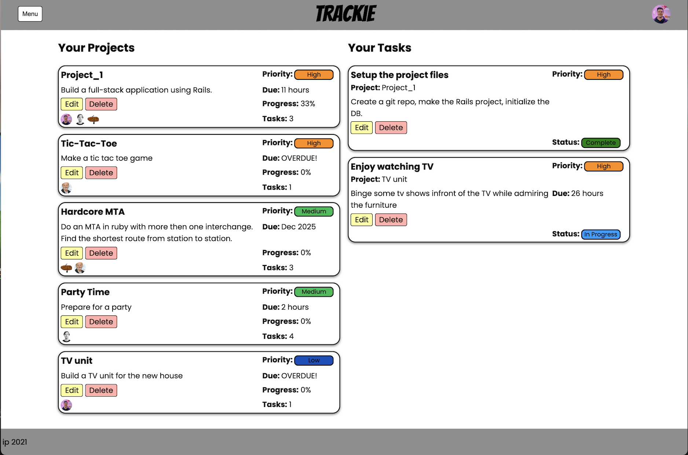

# Trackie

Trackie my "fisher price" expedition into fullstack development.
It's a project tracking application that allows users to create, assign and manage their projects and tasks.

Tasks can be given a due date, priority and status; as well as being assigned to a user to complete.
As the individual tasks get completed the progress of their parent project is automatically updated in the UI to reflect the overall progress of the project.

Users can also create and assign themselves with skills to help other users when selecting them for tasks.

## Check it out: [Trackie](https://dy-trackie.herokuapp.com/)
### Tech stack:
- Ruby on Rails 5.2.6
- CSS
- JavaScript

## How it works
The structure of the project is based around 4 models with a join table to cater for the many to many association between users and skills.

- User
  - `has_many :projects`
  - `has_many :tasks`
  - `has_and_belongs_to_many :skills` 
- Skill
  - `has_and_belongs_to_many :users`
- Project
  - `has_many :tasks`
  - `belongs_to :user`
- Task
  - `belongs_to :project` 
  - `belongs_to :user, optional: true`
  
  

I added in nested forms to support
  - skill creation when creating/editing a user
  - task creation when creating/editing a project
With a little bit of JavaScript I was able to make these nested forms dynamic so multiple of the nested model can be created in one workflow.

I wrote a few methods
- to calculate the time left until a project or task is due that returns in a variety of formats depending on how long is left.
- to update the status of a task based on if a user is assigned or not. Tasks that have no user are automatically "Unassigned", tasks with a user assigned but no other status selected are set to "Assigned".

I built the UI to be responsive, the layouts of the views was aided by some wireframes.

  |   
  -|-
  |   

## Wishlist
- Make a search function to select users for tasks based on their skills
- Implement authorization at the controller level
- Add sorting/filtering to the UI so users can reorganise their projects and tasks
- Make the UI easier to navigate, maybe another dropdown for new iteem creation
## Known Bugs

## Thoughts about the project
After just a week learning backend I found this project to be quite challenging. There was a lot of hurdles to overcome to get this one done, but overall I am happy with what I achieved in the week. 

